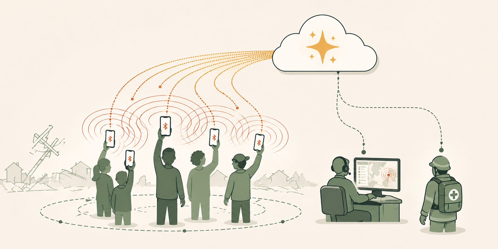
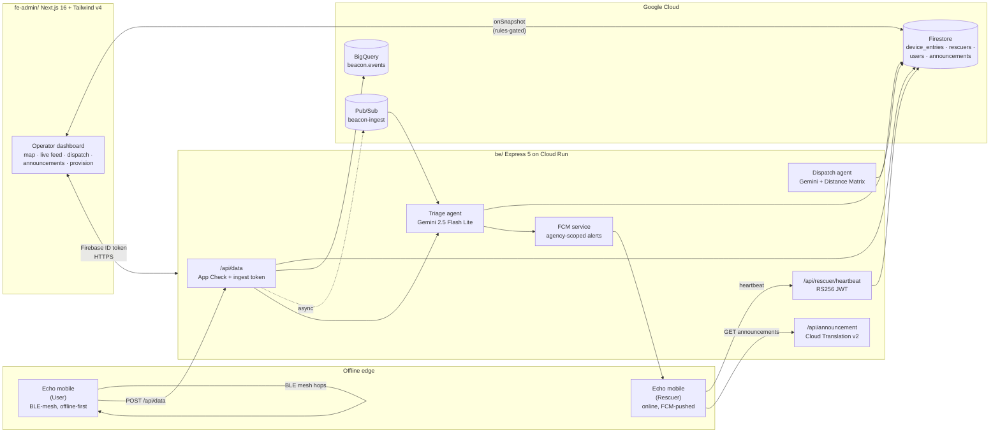

<div align="center">



# Echo Backend

**The cloud half of [Echo](https://github.com/0xteamCookie/echo) — a BLE-mesh crisis-response platform.**

Express 5 API · Firebase · Gemini AI · Next.js operator console

[](https://developers.google.com/community/gdsc-solution-challenge)
[](#)
[](#)
[](#)
[](#)
[](LICENSE)

</div>

---

## Table of Contents

- [What is this?](#what-is-this)
- [Repository layout](#repository-layout)
- [End-to-end architecture](#end-to-end-architecture)
- [`be/` — Express API](#be--express-api)
- [`fe-admin/` — Operator console](#fe-admin--operator-console)
- [Data model](#data-model)
- [AI agents](#ai-agents)
- [Auth and security](#auth-and-security)
- [Local development](#local-development)
- [Deployment](#deployment)
- [Contributing](#contributing)
- [License](#license)

---

## What is this?

When a disaster knocks out cell towers, the [Echo mobile app](https://github.com/0xteamCookie/echo) keeps people connected through an ad-hoc Bluetooth Low Energy mesh. Sooner or later, **one** phone in that mesh gets a single bar of signal — and at that moment it uplinks the entire neighbourhood's accumulated SOS backlog to **this backend**.

This repo is what happens on the other end of that uplink:

1. **`be/`** — a stateless Express 5 API (Cloud Run-ready) that ingests mesh events, runs **Gemini** triage, ranks rescuers with another **Gemini** agent plus **Google Maps Distance Matrix**, fans out FCM alerts, streams events to **BigQuery**, and serves multilingual announcements via **Cloud Translation**.
2. **`fe-admin/`** — a Next.js 16 + Tailwind v4 operator console where 911-style dispatchers see real-time incidents on a map, review AI triage, assign rescuers with one click, and broadcast announcements in 10 languages.

> **Submitted under:** Google Solution Challenge 2026 — *Rapid Crisis Response* theme — *Open Innovation* track.

## Repository layout

```
echo-backend/
├── be/                  # Express 5 API   (Cloud Run / Node 20)
│   ├── src/
│   │   ├── app.ts                     # bootstrap, helmet, CORS, rate limits
│   │   ├── index.ts                   # entrypoint
│   │   ├── lib/                       # config, firebase admin, jwt, geo, logger
│   │   ├── middleware/                # authz, app-check, rescuer-jwt, identifyUser
│   │   └── modules/
│   │       ├── auth/                  # /api/auth
│   │       ├── account/               # /api/account
│   │       ├── data/                  # /api/data        (mobile ingest)
│   │       ├── triage/                # Gemini triage agent
│   │       ├── dispatch/              # /api/dispatch    (Gemini rescuer ranker)
│   │       ├── rescuer/               # /api/rescuer     (heartbeats)
│   │       ├── push/                  # /api/push        (FCM)
│   │       ├── pubsub/                # /api/pubsub      (async triage)
│   │       ├── announcement/          # /api/announcement
│   │       ├── provision/             # /api/provision   (rescuer JWT QR)
│   │       └── bigquery/              # streaming ingest
│   ├── scripts/                       # set-super-admin, check-firestore
│   ├── firebase.json                  # firestore rules + indexes only
│   ├── firestore.rules
│   ├── firestore.indexes.json
│   └── package.json
│
├── fe-admin/            # Next.js 16 operator console
│   ├── src/
│   │   ├── app/                       # App Router routes
│   │   │   ├── page.tsx               # /          Overview (heatmap)
│   │   │   ├── login/                 # Firebase Auth sign-in
│   │   │   ├── live-feed/             # realtime device_entries
│   │   │   ├── dispatch/              # AI dispatch panel
│   │   │   ├── announcement/          # multilingual broadcasts
│   │   │   ├── map/                   # operations map
│   │   │   ├── provision/             # rescuer JWT QR generator
│   │   │   └── settings/
│   │   ├── components/
│   │   ├── hooks/useRealtimeEvents.ts # Firestore onSnapshot
│   │   ├── lib/
│   │   │   ├── api-client.ts          # attaches Firebase ID token
│   │   │   └── auth/                  # session, permissions
│   │   └── proxy.ts                   # Next middleware (CSP, HSTS, noindex)
│   ├── next.config.ts
│   └── package.json
│
└── docs/                # cross-repo architecture & deployment notes
```

## End-to-end architecture



| Plane | Component | Path |
|---|---|---|
| Edge / offline | Mobile app (User and Rescuer roles) | [`../echo`](../echo) |
| Cloud / API | Express 5 + TypeScript on Cloud Run | [`be/`](be/) |
| Cloud / UI | Next.js 16 operator console | [`fe-admin/`](fe-admin/) |

## `be/` — Express API

A stateless Express 5 server in TypeScript. **Not** Firebase Functions — designed for Cloud Run with the Admin SDK.

| | |
|---|---|
| **Runtime** | Node 20 or newer |
| **Framework** | Express 5.2 + TypeScript 6 |
| **Identity** | Firebase Admin SDK (Auth + Firestore) |
| **Async** | Google Cloud Pub/Sub (`@google-cloud/pubsub`) — push subscription |
| **Analytics** | Google Cloud BigQuery streaming inserts |
| **Translation** | Cloud Translation v2 |
| **Maps** | `@googlemaps/google-maps-services-js` (Distance Matrix) |
| **AI** | `@google/generative-ai` — Gemini 2.5 Flash Lite (default) |
| **Hardening** | `helmet`, `express-rate-limit`, strict CORS allowlist, 32 KB JSON cap, App Check on ingest |

### Routes

| Mount | Methods | Purpose |
|---|---|---|
| `/healthz`, `/readyz` | `GET` | Liveness / readiness (Firestore ping with 2 s timeout) |
| `/.well-known/jwks.json` | `GET` | RS256 public key for verifying rescuer JWTs |
| `/api/auth/me` | `GET` | Operator session info |
| `/api/account/me` | `GET` `PATCH` | Operator profile |
| `/api/provision/token` | `POST` | Issue a rescuer JWT (QR-encoded) — `super_admin` only |
| `/api/data` | `POST` `POST /batch` `GET` `POST /:id/status` | Mobile mesh ingest + heatmap query |
| `/api/dispatch/recommendations` | `GET` | Gemini-ranked top-5 rescuers for an incident |
| `/api/dispatch/assign` | `POST` | Assign a rescuer (writes back to `device_entries`) |
| `/api/rescuer/heartbeat` | `POST` | 2-min duty + GPS heartbeat |
| `/api/push/register` | `POST` | Register an FCM token |
| `/api/announcement` | `GET` `POST` | Public read + operator broadcast (auto-translated) |
| `/api/pubsub/triage-push` | `POST` | Pub/Sub push subscriber for async triage |

See [`be/README.md`](be/README.md) for full env-var reference, scripts, and deployment guide.

## `fe-admin/` — Operator console

A Next.js 16 (App Router) + React 19 + Tailwind v4 single-page operator console. **No Next API proxy** — the browser talks to `be/` directly using the user's Firebase ID token, while real-time data comes from **direct Firestore `onSnapshot`** subscriptions gated by Firestore rules.

| | |
|---|---|
| **Framework** | Next.js 16.2 (App Router) |
| **UI** | React 19 + Tailwind v4 + `lucide-react` icons |
| **Maps** | `@vis.gl/react-google-maps` (Maps JS) |
| **Charts** | `recharts` 3.8 |
| **Realtime** | Firebase JS SDK 11 — Firestore `onSnapshot` |
| **Auth** | Firebase Auth (client SDK) — Bearer ID token attached by `lib/api-client.ts` |
| **QR** | `qrcode.react` for rescuer provisioning |

### Routes

| Path | Purpose |
|---|---|
| `/` | Operations overview — map heatmap + latest announcement |
| `/login` | Firebase Auth sign-in |
| `/live-feed` | Realtime `device_entries` table |
| `/dispatch` | Agentic Dispatch panel (Gemini recommendations + assign) |
| `/announcement` | Author multilingual broadcasts with map picker |
| `/map` | Full operations map |
| `/provision` | Issue a rescuer QR-JWT |
| `/settings` | Admin settings (gated by `settings:read`) |

See [`fe-admin/README.md`](fe-admin/README.md) for setup.

## Data model

Firestore collections (rules in [`be/firestore.rules`](be/firestore.rules)):

| Collection | Written by | Read by | Notes |
|---|---|---|---|
| `device_entries` | `be` (`/api/data`) | operators (rules) + Firestore `onSnapshot` | One doc per ingested mesh event. Holds `meta.triage` from Gemini. |
| `rescuers/{sub}` | `be` (`/api/rescuer/heartbeat`) | dispatch ranker | Live duty + GPS state. |
| `users/{uid}` | `super_admin` only | `be` middleware | Mirrors Firebase Auth custom claims (`role`, `agencies[]`). |
| `announcements/{id}` | operators | mobile + operators | Auto-translated map of 10 languages. |
| FCM tokens | rescuer mobile via `/api/push/register` | `be` notify | Agency-scoped delivery. |

Composite indexes ([`be/firestore.indexes.json`](be/firestore.indexes.json)):
- `device_entries(macAddress ASC, receivedAt DESC)`
- `device_entries(agency ASC, receivedAt DESC)`

## AI agents

Both agents use `@google/generative-ai` with **Gemini 2.5 Flash Lite** by default (configurable via `GEMINI_MODEL`).

### 1. Triage agent — [`be/src/modules/triage/triage-agent.service.ts`](be/src/modules/triage/triage-agent.service.ts)

Runs after every ingest. Synchronous when `TRIAGE_ASYNC=false`, otherwise dispatched via Pub/Sub `beacon-ingest` and answered on `/api/pubsub/triage-push`. Uses Gemini's **structured-output** schema:

```jsonc
{
  "categories": ["medical", "trapped"],
  "severity": 5,                       // 1–5
  "summary": "Adult male, leg fracture, building collapse",
  "victimInstructions": ["Stay still", "Conserve battery"],
  "dispatchMessage": "Medical response needed at GPS …",
  "reasoning": "Keywords 'leg' 'collapse' + prior message thread …"
}
```

Threads up to **5 prior messages from the same MAC** as conversation history so a fragmented mesh stream is reasoned about as one incident.

### 2. Dispatch agent — [`be/src/modules/dispatch/dispatch.service.ts`](be/src/modules/dispatch/dispatch.service.ts)

For each open incident, ranks the **top 5 on-duty rescuers** by:

- ETA from Google Maps Distance Matrix (`DISTANCE_MATRIX_ENABLED`)
- Current load (max 4 concurrent assignments)
- Agency match (`medical` / `fire` / `police`)
- Severity from the triage agent
- Specialties on the rescuer profile

Gemini does the final ranking with reasoning, which is shown to the operator in the dashboard.

## Auth and security

The backend accepts **three** distinct caller types behind a single `Authorization: Bearer …` header, all resolved by [`be/src/middleware/authz.ts`](be/src/middleware/authz.ts):

| Caller | Token | Verified by | Permissions |
|---|---|---|---|
| **Operator** (fe-admin) | Firebase ID token | `firebase-admin` | Custom claims `role + agencies[]` (or `users/{uid}` doc fallback) — `data:read`, `data:write`, `provision:issue`, `settings:read` |
| **Mobile mesh ingest** | shared `BEACON_INGEST_TOKEN` | constant-time compare | low-trust `type: "ingest"` only |
| **Rescuer mobile** | RS256 JWT signed with the Firebase service-account key | local verify against JWKS | `/api/rescuer/heartbeat`, `/api/push/register` |

Additional layers:

- **Firebase App Check** required on `POST /api/data*` in production.
- **Helmet** (CSP, HSTS, frameguard, …) on every response.
- **CORS allowlist** — strict, set via `CORS_ORIGINS`.
- **Rate limits** — 300/min global, 120/min on ingest paths, per IP.
- **JSON body cap** — 32 KB. The mesh wire format fits comfortably; anything bigger is rejected.
- **`trust proxy = 1`** — correct client IP behind Cloud Run / load balancer.

See [SECURITY.md](SECURITY.md) for our vulnerability-reporting policy.

## Local development

You will run **two** Node processes side by side. Backend defaults to `:3000`, so the admin console runs on `:3001`.

### 1. Backend (`be/`)

```bash
cd be
cp .env.example .env          # fill in Firebase / Gemini / Maps keys
npm install
npm run dev                   # tsx watch on PORT=3000

# one-time: bootstrap a super-admin
npx tsx scripts/set-super-admin.ts admin@your-domain.com

# deploy Firestore artifacts
npm run firebase:deploy:rules
npm run firebase:deploy:indexes
```

### 2. Operator console (`fe-admin/`)

```bash
cd fe-admin
cp .env.example .env.local
# point NEXT_PUBLIC_BACKEND_URL=http://localhost:3000
npm install
PORT=3001 npm run dev
```

Make sure `CORS_ORIGINS` in `be/.env` includes `http://localhost:3001`.

## Deployment

| Component | Target | Notes |
|---|---|---|
| `be/` | **Google Cloud Run** | Node 20 container; `PORT` from env; `/healthz` + `/readyz` already wired. |
| `fe-admin/` | **Firebase Hosting** or **Vercel** | Static-friendly Next.js 16 build. |
| Firestore rules + indexes | `firebase deploy` from `be/` | `npm run firebase:deploy:rules` / `:indexes`. |
| Pub/Sub topic `beacon-ingest` | Provisioned manually | Push subscription to `https://<be>/api/pubsub/triage-push?token=<PUBSUB_PUSH_TOKEN>`. |
| BigQuery dataset `beacon.events` | Provisioned manually | Streaming inserts from `be`. |

A reference Cloud Run deploy:

```bash
cd be
gcloud run deploy echo-backend \
  --source . \
  --region asia-south1 \
  --platform managed \
  --allow-unauthenticated \
  --set-env-vars-from-file=.env.yaml
```

## Contributing

See [CONTRIBUTING.md](CONTRIBUTING.md) and [CODE_OF_CONDUCT.md](CODE_OF_CONDUCT.md). Security issues — please follow [SECURITY.md](SECURITY.md), do **not** open public issues.

## License

Released under the [MIT License](LICENSE). Built for **Google Solution Challenge 2026** under the *Rapid Crisis Response* theme (Open Innovation track).

> *"When the towers fall, the people are still there. So is the network."*
