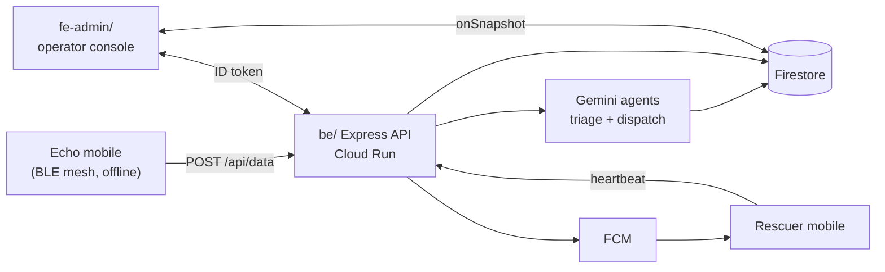

# Echo Backend

Cloud half of the [Echo](https://github.com/0xteamCookie/echo) crisis-response platform. Two packages:

| Folder | Stack | Role |
|---|---|---|
| [`be/`](be/) | Express 5 · TypeScript · Node 20 on Cloud Run | Stateless API. Mesh ingest, Gemini triage, dispatch ranking, FCM, multilingual announcements. |
| [`fe-admin/`](fe-admin/) | Next.js 16 · React 19 · Tailwind v4 | Operator console. Realtime incidents, AI triage review, rescuer assignment, broadcasts. |

Production endpoint: **`https://echo-back.getmyroom.in`**

For the full system context — what Echo is, how the mesh works, the AI pipeline — see the **[main repo](https://github.com/0xteamCookie/echo)**.

## Quick start

You will run two processes side by side: the API on `:3000`, the console on `:3001`.

```bash
# 1. API
cd be
cp .env.example .env          # fill in Firebase + Gemini + Maps keys
npm ci
npm run dev                   # http://localhost:3000

# bootstrap the first super-admin (one-time)
npx tsx scripts/set-super-admin.ts you@example.org

# deploy Firestore rules + indexes
npm run firebase:deploy:rules
npm run firebase:deploy:indexes
```

```bash
# 2. Operator console (separate terminal)
cd fe-admin
cp .env.example .env.local    # backend URL + Firebase + Maps keys
npm ci
PORT=3001 npm run dev         # http://localhost:3001
```

Make sure `CORS_ORIGINS` in `be/.env` includes `http://localhost:3001`.

## Architecture



| Plane | Component |
|---|---|
| Edge | Mobile app — [`echo`](https://github.com/0xteamCookie/echo) |
| Cloud API | [`be/`](be/) |
| Cloud UI | [`fe-admin/`](fe-admin/) |

## Auth

Three caller types behind one `Authorization: Bearer …` header:

| Caller | Token | Verifier |
|---|---|---|
| Operator (`fe-admin`) | Firebase ID token | `firebase-admin` reads custom claims `role` + `agencies[]` |
| Mobile mesh ingest | shared `BEACON_INGEST_TOKEN` | constant-time compare |
| Rescuer mobile | RS256 JWT | local verify against derived JWK at `/.well-known/jwks.json` |

## Deploy

| Component | Target |
|---|---|
| `be/` | Cloud Run — `gcloud run deploy --source .` |
| `fe-admin/` | Vercel or Firebase Hosting |
| Firestore rules + indexes | `npm run firebase:deploy:rules` / `:indexes` from `be/` |

Detailed env-var reference and deploy steps live in [`be/README.md`](be/README.md) and [`fe-admin/README.md`](fe-admin/README.md).

## Contributing

See [CONTRIBUTING.md](CONTRIBUTING.md) and [SECURITY.md](SECURITY.md).

## License

[MIT](LICENSE). Built for **Google Solution Challenge 2026** — *Rapid Crisis Response* · Open Innovation track.
