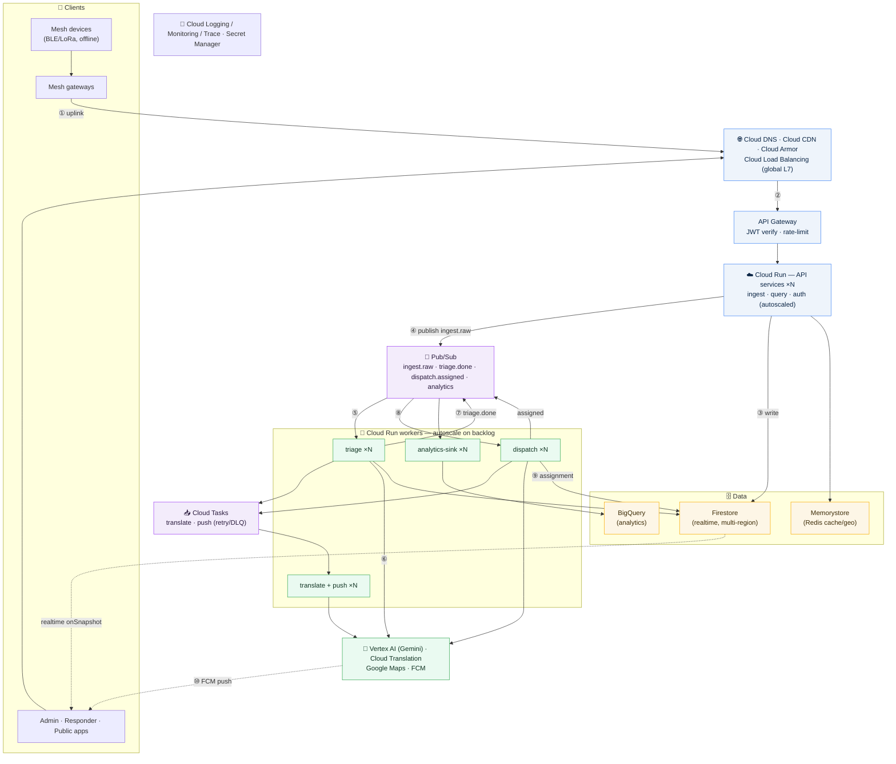

# Echo Backend — Scale-Out Architecture (Google Cloud)

> **Status: aspirational design, not the current deployment.** The repo today runs a
> single Express service that writes to Firestore and fans work out over Pub/Sub. This
> one diagram sketches how that scales to nation-wide disaster load — millions of mesh
> devices firing at once — on managed Google Cloud services: global load balancing,
> autoscaled stateless containers (Cloud Run), an event backbone (Pub/Sub + Cloud
> Tasks), autoscaling worker pools, and a cache tier.
>
> [Mermaid](https://mermaid.js.org), renders inline on GitHub. Numbered edges `①→⑩`
> trace one SOS signal.

**Life of a signal:** ① mesh devices relay SOS to gateways, which batch-uplink through
② the global edge into an autoscaled Cloud Run API. ③ it writes the raw event to
Firestore and ④ publishes to Pub/Sub, then returns `202` — **the hot path ends here.**
Async after that: ⑤ triage workers consume, ⑥ call Vertex AI Gemini for
classification + severity, ⑦ write back and emit `triage.done`; ⑧ dispatch workers rank
responders (+ Maps ETA), ⑨ write the assignment, and hand translation/push to Cloud
Tasks → ⑩ FCM notifies the responder. Firestore `onSnapshot` streams live updates to
the console; every topic mirrors into BigQuery off the hot path.

---

## Google Cloud mapping

| Generic component | Google Cloud service |
|---|---|
| Load balancer / WAF / CDN / DNS | Cloud Load Balancing · Cloud Armor · Cloud CDN · Cloud DNS |
| API gateway | API Gateway (or Apigee) |
| Stateless containers + autoscaling | **Cloud Run** (API + workers; scales on request/backlog) |
| Streaming queue (was Kafka) | **Pub/Sub** — global, ordered keys, retention + replay |
| Task work-queue (was RabbitMQ) | **Cloud Tasks** — per-task retry/DLQ/rate-limit |
| Cache / geo-index (was Redis) | **Memorystore for Redis** |
| Realtime store | **Firestore** (already used; multi-region) |
| Analytics warehouse | **BigQuery** (already used) |
| Object storage | **Cloud Storage** |
| LLM triage/dispatch | **Vertex AI (Gemini)** |
| Translation / Maps / Push | **Cloud Translation · Google Maps Platform · FCM** (already used) |
| Auth | **Firebase Auth / Identity Platform** (already used) |
| Observability / secrets | **Cloud Logging · Monitoring · Trace · Secret Manager** |

> **Multi-region is mostly free here:** Pub/Sub is a global service, Firestore and
> BigQuery are managed multi-region, and the global load balancer fronts Cloud Run in
> two regions — so failover needs no MirrorMaker or manual sharding. If you specifically
> want Kafka semantics, swap Pub/Sub for **Managed Service for Apache Kafka**.

## Bottlenecks & mitigations

| Bottleneck | Trigger | Mitigation |
|---|---|---|
| **Gemini rate/latency** | Mass-casualty spike | Cap worker concurrency; backpressure via Pub/Sub backlog; circuit-break → **deterministic fallback** (already implemented); cache near-duplicate reports |
| **Ingest spike** | Whole city's mesh flushes | Fast `202` ack; Pub/Sub absorbs the burst; Cloud Run autoscales on backlog; idempotent dedup on write |
| **Firestore contention** | Hot region, same docs | Partition topics by region; batch writes; keep realtime store lean, history → BigQuery |
| **Translation cost** | Every announcement × 10 langs | Cache by `(sha(text), lang)` in Memorystore; async via Cloud Tasks |
| **Push fan-out** | Area-wide alert | Batch FCM multicast; Cloud Tasks retry/DLQ |
| **Auth** | Every request carries a JWT | Stateless verify at the gateway; cache JWKS; no per-request DB hit |

Nothing here rewrites domain logic — the `src/modules/*` boundaries (data, triage,
dispatch, announcement, push) map ~1:1 onto the Cloud Run worker pools above.
